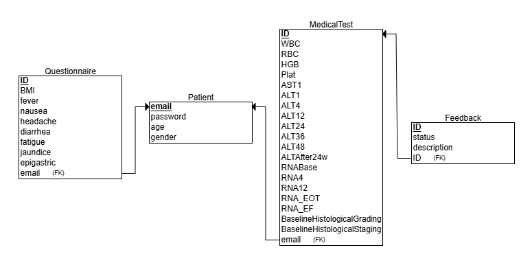
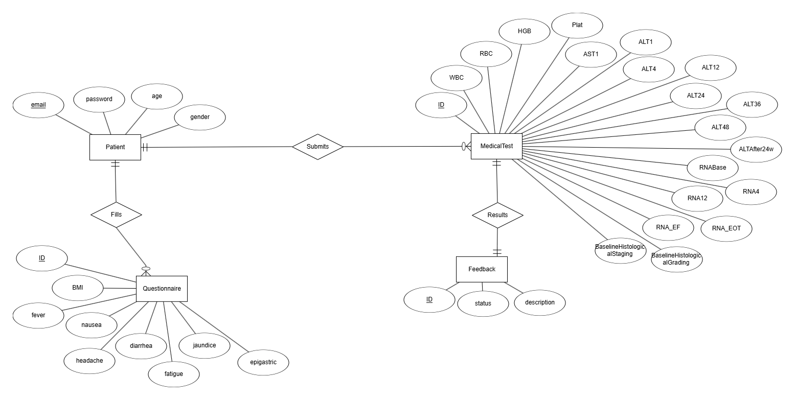

# WithU Backend

This is the backend server for the WithU application, built with Node.js and MySQL.
## ERD



## Setup

1. Clone the repository:
   ```bash
   git clone https://github.com/your-username/your-repo-name.git